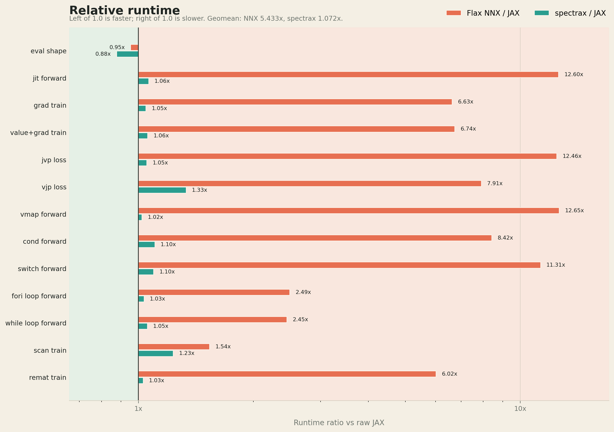
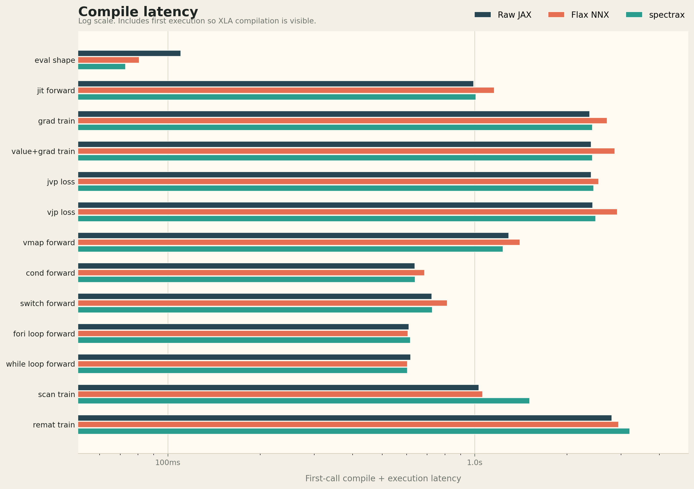

<p align="center">
  
</p>

<p align="center"><b>True MPMD pipeline parallelism for JAX — with an eager module API.</b></p>

<p align="center">
<a href="#quick-start">Quick&nbsp;Start</a> ·
<a href="#installation">Installation</a> ·
<a href="#mpmd-runtime">MPMD&nbsp;Runtime</a> ·
<a href="#sharding-the-symbolic-axis-system">Sharding</a> ·
<a href="#benchmark">Benchmark</a> ·
<a href="#examples">Examples</a> ·
<a href="docs/">Docs</a>
</p>

---

SpectraX is a JAX-native neural-network library built around **true MPMD
pipeline parallelism**. Each physical rank compiles and runs its own XLA
program — no shared `shard_map` HLO, no SPMD-same-shape constraint.
Heterogeneous stages (embed → blocks → head), multimodal stage regions
(vision V0→V3, text T0→T3, …), nine pipeline schedules (GPipe, 1F1B,
ZeroBubble, Interleaved, DualPipeV, …), and a unified `spx.run()` /
`spx.jit()` entry point that dispatches to SPMD or MPMD from the same
training script.

The module API is eager and debuggable — subclass `Module`, override
`forward`, call `model(x)` — but every `Module` is a JAX pytree, so
`jax.jit`, `jax.grad`, and `jax.tree.map` work directly.

> **Used in production.** [EasyDeL](https://github.com/erfanzar/EasyDeL)
> is built on SpectraX: 77 model families (Llama, DeepSeek-V3, Qwen3,
> Gemma, GPT-OSS, Mamba, Whisper, …) with shared sharding, KV-cache,
> and pipeline plumbing. SpectraX is the JAX-only NN core; EasyDeL is
> the model zoo + training/serving stack.

**What is actually different?**

* `sxjit` captures one function, splits its jaxpr at stage markers, and
  emits **one executable per pipeline rank**.
* `sxstage_region` gives each branch or tower its own local stage
  sequence, so multimodal models can lay out vision and text pipelines
  independently instead of pretending they are one long stack.
* Forward, backward, and schedule cells all run through the same true
  MPMD dispatcher — no hidden shard-map fallback when gradients start.
* MPMD stage meshes drop the pipeline axis before inner SPMD layout,
  keeping FSDP/TP/EP constraints stage-local and cache-friendly.

---

## Why SpectraX?

| Capability               | SpectraX                                | JAX + manual        | other JAX frameworks       |
| ------------------------ | --------------------------------------- | ------------------- | -------------------------- |
| **True MPMD**            | built-in (`sxcall`, `sxjit`, `spx.run`) | hand-rolled         | SPMD-only                  |
| **Heterogeneous stages** | native (different class/shape per rank) | fragile             | not supported              |
| **Stage regions**        | branch-local markers for multimodal PP  | very manual         | not supported              |
| **Pipeline schedules**   | 9 schedules (GPipe → DualPipeV)         | hand-rolled         | limited                    |
| **Unified runtime**      | `spx.run(mesh)` → SPMD or MPMD          | separate code paths | separate APIs              |
| **Eager modules**        | `model(x)` + pytree-native              | functional only     | functional or ref-tracking |
| **Symbolic sharding**    | `BATCH`, `EMBED`, `TP`, `FSDP`, …       | string-typed `P`    | manual `PartitionSpec`     |
| **Dispatch overhead**    | ~150 µs                                 | ~N/A                | ~300–2000 µs               |

*Dispatch overhead measured on a tiny 2-layer CPU transformer. See
[Benchmark](#benchmark).*

---

## Quick Start

```bash
pip install spectrax-lib
```

### 1 · Single-device eager training

```python
import jax.numpy as jnp
import spectrax as spx
from spectrax import nn

class MLP(spx.Module):
    def __init__(self, d, h, o, *, rngs):
        super().__init__()
        self.fc1 = nn.Linear(d, h, rngs=rngs)
        self.fc2 = nn.Linear(h, o, rngs=rngs)

    def forward(self, x):
        return self.fc2(nn.gelu(self.fc1(x)))

model = MLP(16, 64, 4, rngs=spx.Rngs(0))

@spx.jit
@spx.value_and_grad
def loss_fn(m, x, y):
    return ((m(x) - y) ** 2).mean()

loss, grads = loss_fn(model, jnp.ones((8, 16)), jnp.zeros((8, 4)))
```

### 2 · Marker-based MPMD — split a function into per-rank programs

```python
from spectrax.runtime.mpmd import sxjit, sxstage_iter
from spectrax.runtime.schedules import Std1F1B
from jax.sharding import PartitionSpec as P

mesh = spx.create_mesh(axis_dims=(4, 1, -1, 1, 1, 1), mpmd_axis="pp")

@sxjit(mesh=mesh, schedule=Std1F1B(microbatches=8))
def pipeline_fwd(model, x):
    x = model.embed(x)                                 # stage 0
    x = sxstage_iter(x, sharding=P("fsdp", None, "tp"))   # boundary — declares the
                                                       # activation sharding the
                                                       # next stage receives
    x = model.blocks[0](x)                             # stage 1
    x = sxstage_iter(x, sharding=P("fsdp", None, "tp"))   # same contract again
    x = model.blocks[1](x)                             # stage 2
    x = sxstage_iter(x)                                # plain identity boundary
    return model.head(x)                               # stage 3
```

`sxjit` traces, splits the jaxpr at `sxstage_iter` markers, and
compiles **one XLA executable per stage / rank**. Each rank only
sees its own sub-graph — true MPMD, not SPMD.

Each marker is functionally the identity but accepts two optional
keywords:

| Arg         | Purpose                                                                                                                              |
| ----------- | ------------------------------------------------------------------------------------------------------------------------------------ |
| `stage=`    | Integer hint for the stage index (validation / debugging only — the cluster splitter partitions purely by marker order).             |
| `sharding=` | `PartitionSpec` declaring the activation layout that flows across this boundary. The compiler honors it during cross-rank transport. |

This is the same pattern EasyDeL uses to keep activation sharding
stable across stage boundaries — see
`easydel.infra.base_module._maybe_emit_stage_boundary`.

### 3 · Stage regions — multimodal pipelines without fake stages

`sxstage_iter` marks a linear sequence. `sxstage_region` marks a
region-local sequence. That is the difference between accidentally
building one giant serial pipeline and deliberately placing each tower:

```text
vision region:  logical stage 0: V0   logical stage 1: V1
                logical stage 2: V2   logical stage 3: V3

text region:    logical stage 0: T0   logical stage 1: T1
                logical stage 2: T2   logical stage 3: T3
```

```python
import spectrax as spx

vision = spx.sxstage_region("vision", schedule=spx.GPipe(microbatches=4))
text = spx.sxstage_region("text", schedule=spx.Std1F1B(microbatches=8))

@spx.jit(mesh=mesh, schedule=spx.DualPipeV(microbatches=8))
def multimodal_forward(model, image, tokens):
    def vision_path(image):
        v = model.vision.patch_embed(image)  # V0
        v = spx.sxstage_iter(v, stage=0)
        v = model.vision.stage1(v)           # V1
        v = spx.sxstage_iter(v, stage=1)
        v = model.vision.stage2(v)           # V2
        v = spx.sxstage_iter(v, stage=2)
        return model.vision.projector(v)     # V3

    def text_path(tokens, vision_features):
        h = model.text.embed(tokens)         # T0
        h = spx.sxstage_iter(h, stage=0)
        h = model.text.stage1(h)             # T1
        h = spx.sxstage_iter(h, stage=1)
        h = model.text.stage2(h)             # T2
        h = spx.sxstage_iter(h, stage=2)
        return model.text.fuse(h, vision_features)  # T3

    v = vision(vision_path)(image)
    h = text(text_path)(tokens, v)
    return model.lm_head(h)
```

The vision markers are scoped to the vision region; the text markers
are scoped to the text region. Each region can use its own schedule,
boundary shardings, and logical stage count, while the outer MPMD
`spx.jit` / `sxjit` still compiles true per-rank programs.

### 4 · One-call MPMD training — `spx.run`

```python
from spectrax.sharding import logical_axis_rules

mesh = spx.create_mesh(axis_dims=(2, 1, -1, 1, 1, 1), mpmd_axis="pp")

with logical_axis_rules(FSDP_TP_RULES), mesh:
    loss, grads = spx.run(
        model,
        inputs=ids,
        targets=labels,
        mesh=mesh,
        mode="train",
        loss_fn=cross_entropy,
        microbatches=8,
    )
```

Drop `mpmd_axis="pp"` and the same code path runs under pure SPMD —
same model, same script, no rewrites.

### 5 · Deferred initialization — infer shapes at runtime

```python
model = nn.Sequential(
    nn.Linear(None, 256, rngs=rngs),   # in_features inferred from first call
    nn.ReLU(),
    nn.Linear(256, 10, rngs=rngs),
)
y = model(jnp.zeros((8, 128)))         # weight shapes resolved here
```

---

## MPMD Runtime

SpectraX implements **true MPMD**: each physical rank compiles and
executes its own distinct JAX program. This is not SPMD-with-barriers
— stages can have different classes, different parameter shapes, and
different I/O shapes.

The public MPMD surface is intentionally narrow and honest:
`sxjit`, `sxgrad`, `sxvalue_and_grad`, `sxcall`, `spx.run` with an
MPMD mesh, and `MpmdPipelineExecutor` all route through the true MPMD
runtime. SPMD-only helpers reject MPMD-tagged meshes instead of
silently taking a shard-map or host-jit fallback.

### `spx.run` — the unified entry point

`spx.run` routes to SPMD (`pjit`) or MPMD (`sxcall`) based on the mesh:

```python
spx.run(
    model,
    inputs=x,                # microbatched along leading axis
    targets=y,
    mesh=mesh,               # SpxMesh — mpmd_axis decides the path
    mode="train",            # "forward" | "train"
    loss_fn=ce_loss,
    microbatches=8,
    schedule=Std1F1B(...),   # optional; defaults to GPipe
)
```

| Mesh type        | What happens                                             |
| ---------------- | -------------------------------------------------------- |
| `mpmd_axis=None` | Pure SPMD — `pjit` with FSDP/TP via logical axis rules   |
| `mpmd_axis="pp"` | True MPMD — auto-split into stages, per-rank compilation |

For `mode="train"`, `inputs`/`targets` accept arrays, tuples, or dicts;
SpectraX threads them into `model.forward(...)` and `loss_fn(...)`.

### Lower-level primitives

| Primitive                     | Purpose                                                                                           |
| ----------------------------- | ------------------------------------------------------------------------------------------------- |
| `sxcall`                      | Execute a `PipelineSequential` through the same scheduled MPMD dispatcher used by `sxjit`.        |
| `sxjit`                       | Decorator: trace -> split at `sxstage_iter` markers -> compile one XLA executable per stage/rank. |
| `sxgrad` / `sxvalue_and_grad` | Schedule-faithful gradients of an `sxjit` function.                                               |
| `treduce`                     | Schedule-driven microbatch reduction — binds a body + schedule into the traced jaxpr.             |
| `sxstage_iter`                | Marker primitive for stage boundaries inside `sxjit`.                                             |
| `sxstage_region`              | Region marker for multimodal/branched pipelines that need independent logical stage sequences.    |
| `spx.assign_stage`            | Context manager that stamps subsequently-created variables with a `(current, total)` stage tag.   |

### Supported schedules

| Schedule                 | Type    | Key trait                                                                 |
| ------------------------ | ------- | ------------------------------------------------------------------------- |
| `GPipe`                  | Flat    | All forwards, then all backwards. Simple, high memory.                    |
| `Std1F1B`                | Flat    | Standard 1-forward-1-backward. Peak memory `O(n_stages)`.                 |
| `Eager1F1B`              | Flat    | 1F1B variant that aggressively starts the backward pipe.                  |
| `ZeroBubbleH1`           | Flat    | Splits BWD into input-grad + weight-grad; weight-grad fills bubble slots. |
| `InterleavedH1`          | Virtual | Each rank owns `v` non-contiguous stages. Bubble shrinks by `v`.          |
| `InterleavedGPipe`       | Virtual | GPipe analog of InterleavedH1.                                            |
| `Interleaved1F1BPlusOne` | Virtual | Interleaved 1F1B with one extra warmup microbatch.                        |
| `DualPipeV`              | Virtual | V-shaped bidirectional pipeline (DeepSeek-style).                         |
| `KimiK2`                 | Virtual | Interleaved with extra warmup (Moonshot K2 design).                       |

### Choosing & using a schedule

All schedules share the same constructor shape: `microbatches=` is
required; virtual-stage schedules also take `virtual_stages=`. Every
schedule object exposes `bubble_ratio(n_stages)`,
`peak_activations(n_stages)`, and `total_steps(n_stages)` so you can
compare them analytically before launching:

```python
from spectrax.runtime.schedules import (
    GPipe, Std1F1B, ZeroBubbleH1, InterleavedH1, DualPipeV,
)

n = 4   # pipeline depth
m = 16  # microbatches

for sc in [
    GPipe(m),
    Std1F1B(m),
    ZeroBubbleH1(m),
    InterleavedH1(m, virtual_stages=2),
    DualPipeV(m),
]:
    print(f"{type(sc).__name__:14s}  bubble={sc.bubble_ratio(n):.3f}  "
          f"steps={sc.total_steps(n)}  peak_acts={sc.peak_activations(n)}")
```

Pass the chosen schedule to `spx.run`, `spx.jit`, `sxcall`, or `sxjit`:

```python
# spx.run — picks SPMD or MPMD by mesh
loss, grads = spx.run(
    model, inputs=x, targets=y, mesh=mesh,
    mode="train", loss_fn=ce_loss,
    microbatches=m, schedule=Std1F1B(m),
)

# sxcall — explicit MPMD on a PipelineSequential
loss, grads = sxcall(
    model, (x, y),
    mesh=mpmd_mesh, schedule=ZeroBubbleH1(m), loss_fn=ce_loss,
)

# sxjit — marker-based MPMD compile
@sxjit(mesh=mesh, schedule=InterleavedH1(m, virtual_stages=2))
def step(model, x):
    ...
```

Legacy knobs that forced host-side schedule walking (`fuse_1f1b`,
`fuse_zb`, `chunks`, non-`device_put` transports, activation donation)
are rejected on the true scheduled MPMD path. Use schedules that emit
the desired fused cells directly.

Rough rule of thumb:

| Goal                                     | Pick                              |
| ---------------------------------------- | --------------------------------- |
| Simplest schedule                        | `GPipe`                           |
| Steady-state memory `O(n_stages)`        | `Std1F1B`                         |
| Fill the 1F1B bubble                     | `ZeroBubbleH1`                    |
| Shrink bubble further at extra transport | `InterleavedH1(virtual_stages=v)` |
| DeepSeek-style V-shape                   | `DualPipeV`                       |
| Long-context / Moonshot-K2-style         | `KimiK2`                          |

### Heterogeneous stages

No same-shape constraint. Stages can be completely different:

```python
model = PipelineSequential(
    EmbedStage(vocab, d, rngs=rngs),       # (B, S) int → (B, S, d)
    BlockStage(d, rngs=rngs),               # (B, S, d) → (B, S, d)
    BlockStage(d, rngs=rngs),               # (B, S, d) → (B, S, d)
    HeadStage(d, vocab, rngs=rngs),        # (B, S, d) → (B, S, vocab)
)
```

`spx.run` also auto-splits homogeneous stacks: it detects a
`ModuleList` named `blocks` and slices it evenly across pipeline
stages — no pipeline-aware bookkeeping in user code.

---

## Sharding: the symbolic-axis system

SpectraX separates *what* a tensor axis means (`BATCH`, `EMBED`, `TP`, `FSDP`)
from *which* mesh axis it lands on. Layer authors write symbolic tokens;
the runtime picks the actual `PartitionSpec` based on the active mesh
and runtime mode (training vs. autoregressive decode).

```python
from spectrax import PartitionAxis, PartitionManager, common_types as ct

paxis = PartitionAxis()  # defaults: dp/fsdp/tp/sp/ep
with PartitionManager(paxis):
    h = ct.apply_logical_sharding(h, dynamic_axes=ct.HiddenStateSharding)
    # h is now constrained to (BATCH, QUERY_LENGTH, EMBED)
    # → resolved at runtime to whatever mesh the user is running on
```

Pre-baked symbolic shapes ship for the common cases:
`HiddenStateSharding`, `AttnQSharding`, `AttnKVSharding`, `RowWise`,
`ColumnWise`, `Replicated`, plus an `Expert*` family for MoE.

This is the same axis system EasyDeL uses to ship 77 model families
without per-model sharding code — see
[`easydel.axis`](https://github.com/erfanzar/EasyDeL-SpecTrax/blob/main/easydel/axis.py)
for an example of registering a domain-specific axis token (`ATTN_DP`)
that shadows `DP` only for KV-cache placement.

---

## Module-aware JAX transforms

| Transform                                                      | What it does                                              |
| -------------------------------------------------------------- | --------------------------------------------------------- |
| `spx.jit`                                                      | `mutable=` + `mesh=` + `schedule=` — one entry, SPMD/MPMD |
| `spx.grad` / `spx.value_and_grad`                              | `wrt=` selector picks the differentiated subset           |
| `spx.vmap`                                                     | module states passed with `in_axes=None` automatically    |
| `spx.scan` / `spx.remat_scan`                                  | module-aware loops, optionally checkpointed               |
| `spx.remat`                                                    | gradient checkpointing (function- and class-aware)        |
| `spx.cond` / `spx.switch` / `spx.while_loop` / `spx.fori_loop` | module-aware control flow                                 |
| `spx.eval_shape`                                               | shape-inference without running ops                       |
| `spx.jvp` / `spx.vjp`                                          | forward / reverse-mode lifts that respect `mutable=`      |

### `spx.jit` in depth

`spx.jit` accepts every keyword `jax.jit` does, plus three SpectraX-only
ones: `mutable=`, `mesh=`, and `schedule=`. The mesh decides where the
call goes:

```python
@spx.jit                                 # plain jax.jit — no mesh
def fwd(model, x): return model(x)

@spx.jit(mutable="batch_stats")          # writes to "batch_stats" survive the call
def train_bn(model, x):
    return ((model(x)) ** 2).mean()

@spx.jit(mesh=spmd_mesh)                 # SPMD pjit — uses spmd_mesh
def fwd(model, x): return model(x)

@spx.jit(mesh=mpmd_mesh, schedule=Std1F1B(microbatches=8))
def step(model, x):                      # MPMD — internally calls sxjit
    x = model.embed(x)
    x = sxstage_iter(x)
    x = model.blocks[0](x)
    ...
```

| Keyword                                                          | Meaning                                                                                                                                                        |
| ---------------------------------------------------------------- | -------------------------------------------------------------------------------------------------------------------------------------------------------------- |
| `mutable=`                                                       | Selector / collection-name sugar: which collections may be written back after the call. Anything else throws `IllegalMutationError`. Default `()` (read-only). |
| `mesh=`                                                          | `SpxMesh`. If `mesh.is_mpmd`, the call is forwarded to `sxjit` (true MPMD). Otherwise plain `jax.jit`.                                                         |
| `schedule=`                                                      | `Schedule` instance, only meaningful when `mesh` is MPMD. Forwarded to `sxjit`.                                                                                |
| `static_argnums` / `static_argnames`                             | Same as `jax.jit`. Static `Module` args are recommended (graph baked into the trace).                                                                          |
| `donate_argnums`                                                 | Same as `jax.jit`. Useful for handing off optimizer state in-place under MPMD.                                                                                 |
| `in_shardings` / `out_shardings`                                 | Same as `jax.jit`. Forwarded verbatim under SPMD; under MPMD they are resolved against per-stage sub-meshes.                                                   |
| `keep_unused`, `device`, `backend`, `inline`, `compiler_options` | Forwarded to `jax.jit`. Rejected with a clear error when `mesh` is MPMD (no analog in `sxjit`).                                                                |

When `mutable=` is set, the compiled function takes the form
`(states, stripped_args, stripped_kwargs)` internally — `static_argnums`
and `donate_argnums` index into that 3-tuple, so prefer the
`*_argnames` variants whenever possible.

The cache is keyed on the input modules' `GraphDef` snapshot. Mutating
parameter values does **not** invalidate the cache; structural changes
(adding/removing/replacing a Module or Variable attribute) do.

### Selector DSL

One composable predicate for every "subset of the model" API:

```python
spx.grad(loss, wrt="parameters")                  # by collection name
spx.grad(loss, wrt=nn.LoraParameter)              # by Variable class
spx.grad(loss, wrt=spx.path_contains("attn"))     # by path glob

# Compose with set algebra
sel = (
    spx.select()
        .at_instances_of(nn.Linear)
        .of_type(spx.Parameter)
    - spx.path_contains("head")
)
trainable, frozen = sel.partition_state(model, state)
```

The same DSL backs `grad(wrt=...)`, `jit(mutable=...)`,
`Optimizer(wrt=...)`, `freeze(...)`, and `iter_variables(select=...)`.

---

## Features

### LoRA fine-tuning

```python
base  = nn.Linear(768, 768, rngs=spx.Rngs(0))
model = nn.wrap_lora(base, rank=8, alpha=16, rngs=spx.Rngs(1))

@spx.jit
@spx.grad(wrt="lora")
def step(m, x, y):
    return ((m(x) - y) ** 2).mean()
```

### FP8 training (delayed scaling, rolling amax history)

```python
@spx.jit(mutable="fp8_meta")
def step(m, x, y):
    def loss(m, x, y):
        return ((m(x) - y) ** 2).mean()
    return spx.grad(loss)(m, x, y)
```

### Explicit graph / state seam

```python
gdef, state = spx.export(model)          # immutable GraphDef + State dict
model2      = spx.bind(gdef, state)      # reconstruct, skips __init__
spx.update(model, state)                 # in-place state patch
clone       = spx.clone(model)           # deep-copy via export+bind
```

### Inspection

```python
spx.inspect.summary(model, jnp.zeros((1, 128)))
spx.inspect.count_parameters(model)
spx.inspect.count_bytes(model)
spx.inspect.tabulate(model, example_input)
```

### Built-in layers

Linear, `Conv1d/2d/3d` + `ConvTranspose*`, MultiheadAttention,
LayerNorm, RMSNorm, BatchNorm, InstanceNorm, GroupNorm, Dropout,
Embed, MLPBlock, MoE primitives, RNN/GRU/LSTM cells, FP8 path,
LoRA path, plus containers (`Sequential`, `ModuleList`, `ModuleDict`,
`StackedModuleList` for repeated transformer blocks under `lax.scan`).

---

## Installation

```bash
pip install spectrax-lib

# Optional extras
pip install "spectrax-lib[contrib]"   # optax integration
pip install "spectrax-lib[cuda]"      # CUDA jaxlib
pip install "spectrax-lib[tpu]"       # TPU jaxlib
```

From source:

```bash
git clone https://github.com/erfanzar/spectrax
cd spectrax
uv sync --extra dev --extra test --extra contrib
```

Requires Python 3.11+ and JAX ≥ 0.9.2.

---

## Examples

Seven topic folders under [`examples/`](examples/) progress from
single-Module forward passes to multi-device MPMD pipeline training:

| Folder                                                          | Topic                                                               |
| --------------------------------------------------------------- | ------------------------------------------------------------------- |
| [`01_basics/`](examples/01_basics/)                             | Modules, training loops, export/bind, optimizers                    |
| [`02_implementation_guide/`](examples/02_implementation_guide/) | Llama 3, Qwen 2, GPT-2, ViT, custom transformer                     |
| [`03_transformations/`](examples/03_transformations/)           | jit, grad, vmap, remat, scan, fori_loop                             |
| [`04_surgery/`](examples/04_surgery/)                           | Selectors, LoRA injection, FP8, freezing, swapping                  |
| [`05_shardings/`](examples/05_shardings/)                       | FSDP, TP, hybrid sharding, logical axis rules                       |
| [`06_spmd_scheduled/`](examples/06_spmd_scheduled/)             | Pipeline runtime with all schedules                                 |
| [`07_mpmd/`](examples/07_mpmd/)                                 | Real MPMD pipeline via `spx.run` / `sxjit` — train, forward, decode, stage regions, stage-local meshes |

```bash
python -m examples.01_basics.02_training_loop
python -m examples.01_basics.06_multi_optimizer_lora
python -m examples.02_implementation_guide.01_llama3
python -m examples.07_mpmd.01_train_homogeneous
python -m examples.07_mpmd.12_stage_region_multimodal
```

Most examples run on CPU with small configs; sharding and pipeline
examples benefit from multi-device TPU / GPU but fall back cleanly
to one device.

---

## Used by

* **[EasyDeL](https://github.com/erfanzar/EasyDeL)** — production
  training/serving framework for LLMs, multimodal models, and vision
  models. SpectraX is the NN core; EasyDeL adds the model zoo
  (Llama, Qwen3, DeepSeek-V3, Gemma, GPT-OSS, Mamba, Whisper, …),
  trainers, KV cache, and inference engine. EasyDeL leans on
  `spx.Module`, `spx.Rngs`, `spx.Parameter`, `spx.assign_stage`,
  `spx.sxstage_iter`, the `PartitionAxis` registry, and the
  `common_types` symbolic-axis tokens.

If your project uses SpectraX, open a PR to add it here.

---

## Design

1. **True MPMD first.** `sxcall` and `sxjit` use the scheduled MPMD
   dispatcher, compiling distinct per-rank programs. Stages can differ
   in class, shape, and parameters. No SPMD-same-shape constraint.
2. **Unified runtime.** `spx.run` dispatches on the mesh. Same model,
   same script; change the mesh and you change the parallelism strategy.
3. **Schedule-faithful execution.** The runtime follows the schedule
   grid exactly as planned. No hidden SPMD fallback, no implicit legacy
   schedule walker.
4. **Modules are JAX pytrees.** Flatten/unflatten via `export`/`bind`.
   `jax.jit`, `jax.tree.map`, `jax.value_and_grad` work directly.
5. **State lives in `Variable` cells.** `Parameter`, `Buffer`, and
   user subclasses; each tags its collection (`parameters`, `buffers`,
   `lora`, `fp8_meta`, …).
6. **One filter DSL everywhere.** `Selector` serves `grad(wrt=...)`,
   `jit(mutable=...)`, `Optimizer(wrt=...)`, `freeze(...)`,
   `iter_variables(select=...)`.
7. **Symbolic sharding tokens.** Layer code says `BATCH`, `EMBED`,
   `TP`; `PartitionManager` resolves the active mesh at runtime.
   Decode-mode overrides flow through the same tokens — no
   per-mode forking in layer code.

---

## Benchmark

```bash
python -m benchmarks.bench --cases all --device cpu
python -m benchmarks.bench --cases large --device tpu     # 1.21B transformer
python -m benchmarks.llama_transforms_3way --preset small --device tpu --plots
```

The CPU dispatch benchmark writes
`benchmarks/results/latest.{json,md}` with per-case `spectrax_ms /
nnx_ms` ratios. On a tiny CPU dispatch-bound benchmark (2-layer / d=64
/ batch-2 transformer), SpectraX runs at **1.83x** the speed of
flax.nnx; on d=48 it hits **2.0x**. On compute-bound workloads (TPU
8B) the Python gap shrinks but stays positive.

The plots below are from the **TPU small** three-way Llama transform
benchmark, comparing raw JAX, Flax NNX, and SpectraX across the
transform surface used by real training code: `jit`, `grad`,
`value_and_grad`, `jvp`, `vjp`, `vmap`, control flow, `scan`, and
`remat`. Ratios are runtime against raw JAX, so **1.0 is parity**,
**lower is faster**, **higher is slower**.



Compile latency is tracked separately because first-call XLA costs
can dominate short benchmark cases and tell a different story from
steady-state runtime.



---

## Testing

```bash
pytest tests/ -q
pytest tests/test_conformance.py
```

---

## License

This project is licensed under AGPL-3.0-or-later.

If you use EasyDeL or SpecTrax in research, infrastructure, benchmarks,
or derivative systems, please provide attribution and cite the project.

## Citation

```cite
@software{easydel,
  author = {Erfan Zare Chavoshi},
  title = {EasyDeL},
  year = {2023},
  url = {<https://github.com/erfanzar/EasyDeL}>
}
```
